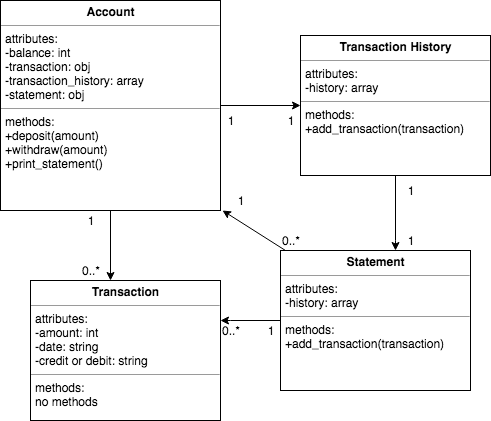
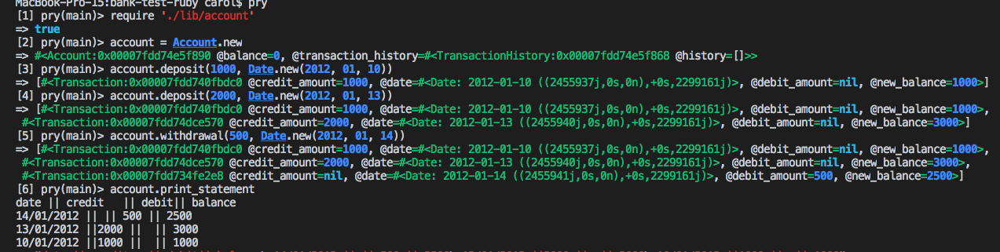

# Bank Tech Test 
A simple app that allows the user to: 
* create an account
* deposit money
* withdraw money
* keeps a record of all transactions and 
* print a copy of their statement

# Quickstart
```
$ git clone https://github.com/CazaBelle/bank-tech-test-ruby.git
$ cd bank-tech-test-ruby
$ bundle install 
$ bundle exec rspec #Run the tests
$ rubocop #confirm the code is linted
```

# User Stories 
```
As a user 
So that I can keep track of my money
I would like to be able to have a bank account 

As a user
So that I can pay my rent
I would like to be able to make a deposit

As a user
So that I can have fun
I would like to be able to make a withdrawal

As a user
So that I can see a history of my account transactions
I would like to be able to print out a bank statement

As a user 
So that I can put my transactions in order
I would like to see a date with every transaction
```

# Class Diagram


# How to use
```
$ pry
[1]pry(main)> require './lib/account.rb
[2]pry(main)> account = Account.new
[3]pry(main)> account.deposit(100)
[4]pry(main)> account.withdrawal(50)
[5]pry(main)> account.print_statement
```

# Demo


# Code Quality 
* Simplecov
* Rubocop

# Acceptance criteria
```
Given a client makes a deposit of 1000 on 10-01-2012
And a deposit of 2000 on 13-01-2012
And a withdrawal of 500 on 14-01-2012
When she prints her bank statement
Then she would see
```
```
date || credit || debit || balance
14/01/2012 || || 500.00 || 2500.00
13/01/2012 || 2000.00|| || 3000.00
10/01/2012 || 1000.00|| || 1000.00
```